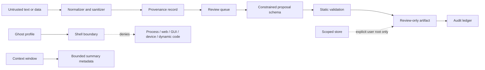

# Guarded MOSS-Inspired Extension Design — 2.1

## Purpose

This design adapts the useful **organizational** ideas in the supplied GhostOS/MOSS notes—small code-like artifacts, bounded context summaries, provenance-aware data intake, and reviewable capability proposals—without adopting their live-code, autonomous shell, hardware-control, event-bus, or dynamic-import claims.

> **Core rule:** Conversation or model output may become a *proposal for review*; it must never become imported, executed, scheduled, dispatched to a device, or treated as authority.

The implementation is isolated under `ribit_2_0/guarded_moss/`. It does not modify the existing agent, Matrix, controller, ROS, GUI, or provider paths. This separation is deliberate: the existing repository has broad automation-oriented modules, while the new package offers a local, data-only boundary that future integrators may adopt selectively.

## Source provenance

| Submitted note | SHA-256 | Concepts considered | Treatment |
| --- | --- | --- | --- |
| `pasted_content.txt` | `c61d9f12b32e7df8207aa6c695b3b4334b4cc3e0d0da3cc4c33496d9244f2029` | MOSS-style interfaces, file-based precipitation, context compaction | Reframed as review-only proposals, bounded local records, and deterministic summaries. |
| `pasted_content_2.txt` | `b19ee90f7d44632c521dd25b25dfefa4e459ba6a0e3f34c15d68519730e277e2` | QML presentation, Ghost/Shell metaphors, hardware and skill generation | QML is documented as optional presentation research only; live shell, device, asynchronous-worker, and autonomous skill execution are blocked. |

The attached texts are **reference data**, not executable requirements. Claims about third-party architectures are not relied upon as security guarantees.

## Design decisions

| Concern | 2.1 decision | Explicitly excluded |
| --- | --- | --- |
| “Ghost” identity | A `GhostProfile` contains only display-oriented identity and declared safe scopes. | Consciousness claims, tool ownership, or independent action. |
| “Shell” concept | `ShellBoundary` returns transparent denials and records no command. | Command execution, process spawning, code evaluation, terminal control. |
| Data intake | `DataIntake` creates a bounded record with source label, digest, and review state. | Automatic ingestion into knowledge or prompts. |
| Context retention | `ContextWindow` compacts a supplied list into bounded metadata. | Background history purge, hidden memory mutation, autonomous scheduling. |
| “Precipitation” | `Proposal` stores a constrained Python *template description* and validation result. | Writing Python from model text, importing it, compiling it as a program, or activating it. |
| Workspace files | `ScopedStore` accepts only user-approved root paths and controlled artifact suffixes. | Traversal, symlinks, dynamic module loading, arbitrary filesystem access. |
| Policy | `CapabilityPolicy` starts empty and blocks process, network, GUI, device, dynamic-code, and autonomous-loop capabilities. | Broad allowlists or implicit grants. |
| QML | `QmlResearchNote` holds declarative UI metadata for documentation. | QML runtime installation, JavaScript execution, or hardware-accelerated UI control. |

## Package map

## Acceptance criteria

The extension will be accepted only if its test suite demonstrates all of the following:

| Category | Required evidence |
| --- | --- |
| Data provenance | Source labels, input digest, and bounded excerpts are retained. |
| Scope control | Traversal and non-approved paths are denied. |
| Policy | Process, web, GUI, device, dynamic code, and autonomous-loop capabilities remain denied by default. |
| Proposal safety | Proposals reject imports, executable statements, dangerous names, malformed schemas, and excessive content. |
| Non-execution | Shell and activation APIs return explicit denials and never invoke `subprocess`, `exec`, `eval`, import hooks, or device APIs. |
| Context bounds | Compaction preserves a small deterministic summary rather than unbounded turn history. |
| Packaging | The new package compiles, tests pass, runtime data is ignored, and docs state the limitation. |

## Non-goals

This branch is not a GhostOS deployment, an E2EE implementation, a QML desktop application, an NVIDIA setup, a robot controller, a model-hosting service, a Matrix command executor, or an automatic self-modifying agent. It contains no external dependency and no background worker.
